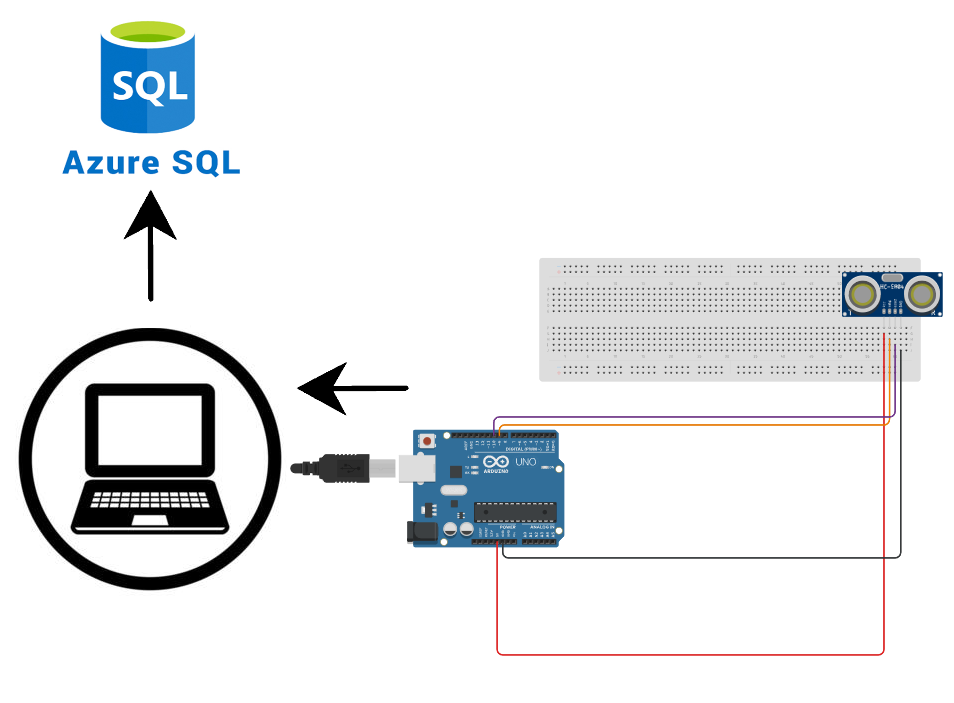

# Hardware to Cloud
Simulate extracting data from IoT sensor then storing into Azure SQL Database


## Installation

1. Clone repository <br>
```git clone https://github.com/jazcodeit/harware_to_cloud.git```

2. Setup environment
```
    DATABASE_SERVER=your_db_host
    DATABASE_NAME=your_database_name
    DATABASE_USER=your_db_username
    DATABASE_PASSWORD=your_db_password
    DATABASE_PORT=your_db_port
```

## How to Use

1. Install dependencies <br>
```pip install -r requirements.txt```

2. Connect your Ardiuno <br>

3. Open sensors.ino and upload the code to Ardiuno board<br/>
```./sensors/sensors.ino```

4. Run portListener.py <br>
```python portListener.py```